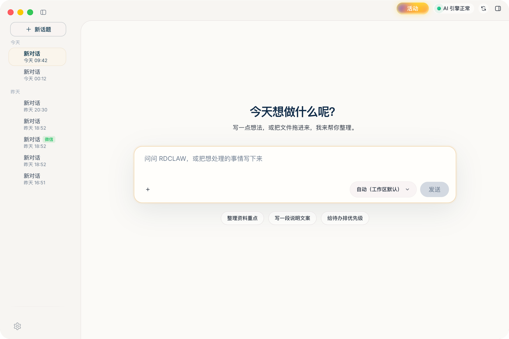

# Agentic AI Showcase — RDCLAW (睿动AI)

**We build agents that ship — not demos.**

An enterprise-grade agentic AI desktop platform, in production on Windows and macOS.

[Product Site](https://iruidong.com/rdclaw/) ·
[Engineering Write-up](https://xl636.github.io/agentic-ai-showcase/building-agentic-ai.html) ·
[Portfolio Page](https://xl636.github.io/agentic-ai-showcase/)

-v0.1.10-2ea44f)

---

## What this is

**RDCLAW (睿动Claw)** is an agentic AI desktop platform we designed, built, and shipped: one install gets you autonomous agents that plan, call tools (files, browser, shell, MCP), self-correct on failure, run on their own schedule, and deliver results into the IM tools enterprises actually use (Feishu/Lark and DingTalk).

It bundles a self-developed agent inference engine built on the OpenClaw open-source agent framework, with multi-model routing across 10+ providers (GLM, DeepSeek, OpenAI, Anthropic, Google, and more).

## 🎥 Demo

*Demo video coming shortly — a 2-minute walkthrough of an agent completing a multi-step task and a scheduled agent delivering results into DingTalk.*

## Highlights

| Capability | What it means in practice |
| --- | --- |
| **Autonomous agent loop** | Goal in, result out: agents plan, use tools, observe, and decide the next step — no rigid pipelines, no hard-coded step limits. |
| **Two-layer resilience** | A deterministic engine (provider fallback chains, exponential backoff, safe-mode degradation — never a hard crash) underneath a reasoning loop that reads errors and routes around failures. |
| **Proactive scheduled agents** | Plain-language cron: *"every weekday at 9am, summarize and send to me."* The agent wakes itself, works, and delivers into Feishu / DingTalk. |
| **Multi-agent personas** | Multiple independent agents per user, each with its own personality, memory, and tool permissions. |
| **Visible guardrails** | Three-tier command execution safety, OS-native key encryption (Windows DPAPI), sandbox isolation, allowlists and command gating for group chats. |
| **Open extensibility** | 30+ built-in skills; external tools attach through MCP and a plugin interface — contracts, not hacks. |

## Content we've created about agentic AI

- 📝 **[Shipping an Agentic AI Desktop Platform: Engineering Lessons from Building RDCLAW](https://xl636.github.io/agentic-ai-showcase/building-agentic-ai.html)** — our production write-up: two-layer resilience, proactive scheduling, and guardrails users can see. ([Markdown version](blog/building-agentic-ai.md))
- 🌐 **[Product site & full user manual](https://iruidong.com/rdclaw/)** — downloads, feature documentation, IM integration and scheduled-task guides.
- 🗒️ **Release cadence** — [Windows release notes](https://iruidong.com/rdclaw/release-notes-1.4.0.html) · [Mac release notes](https://iruidong.com/rdclaw/release-notes-mac.html)

## Why we think agentic AI is the transition that matters

Chatbots respond; agents act. The teams that win the move from "impressive demo" to "infrastructure you stake your morning report on" will be the ones who treat **resilience, scheduling, and governance** as first-class features. That is the bet we made with RDCLAW — the full reasoning is in [the write-up](https://xl636.github.io/agentic-ai-showcase/building-agentic-ai.html).

---

© 2025–2026 睿动AI (RDCLAW Team). Showcase content; all product names and assets belong to their owners.

