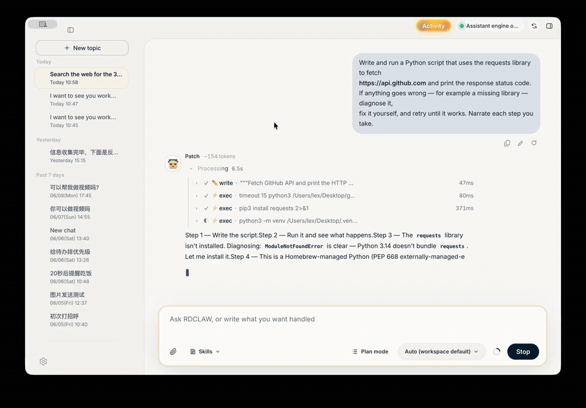

# RDCLAW (睿动Claw) — Agentic AI Desktop Platform

Our agentic AI work: an enterprise agent desktop platform, in production on Windows (v1.5.2) and macOS (Apple Silicon, v0.1.10).

[Product site & user manual](https://iruidong.com/rdclaw/)

## 🎥 Demo: a real autonomous agent

These are unedited screen recordings of RDCLAW given a goal in plain English. What makes it an agent rather than a chatbot: it **plans, calls tools (web search, shell, files), observes the results, and self-corrects until the task is done** — including diagnosing and fixing its own failures mid-task without human help.

*Above: mid-task, the agent hits a real failure — `ModuleNotFoundError` plus an unexpected PEP 668 externally-managed Python — diagnoses both, creates a virtualenv, installs the dependency, and retries to success. Unprompted, narrating each step.*

### ▶ [Watch all demos in your browser](https://xl636.github.io/agentic-ai-showcase/)

| Clip | What it proves |
| --- | --- |
| [① Autonomous end-to-end run · 56s](https://xl636.github.io/agentic-ai-showcase/#demo-1) | One goal in: research the web → write a sourced report → save to disk → verify its own work. Finishes with "zero human intervention, zero failures." |
| [② Research → deliverable · 85s](https://xl636.github.io/agentic-ai-showcase/#demo-2) | Parallel web searches and page fetches, source-linked summary, file written to disk and read back to confirm correctness. |
| [③ Code, execute, report · 63s](https://xl636.github.io/agentic-ai-showcase/#demo-3) | Inspects the local Python environment, writes a script, executes it, returns verified output. |
| [④ Self-healing ★ · 42s](https://xl636.github.io/agentic-ai-showcase/#demo-4) | Hits a missing dependency **and** a PEP 668 environment restriction; diagnoses, builds a venv, installs, retries until success — narrating every step. |

Raw files: [①](media/demo-1-autonomous-end-to-end.mp4) · [②](media/demo-2-research-to-file.mp4) · [③](media/demo-3-code-and-execute.mp4) · [④](media/demo-4-self-healing.mp4)

## What it is

RDCLAW bundles a self-developed agent inference engine (built on the OpenClaw open-source agent framework) into a one-click desktop install:

- **Autonomous agent loop** — no rigid pipelines, no hard-coded step limits; the model decides the next step.
- **Multi-model routing** — 10+ providers (GLM, DeepSeek, OpenAI, Anthropic, Google, …) with deterministic fallback.
- **Multi-agent personas** — independent agents, each with its own personality, memory, and tool permissions.
- **Open extensibility** — 30+ built-in skills; external tools attach over MCP.
- **Guardrails** — three-tier command-execution safety, OS-native key encryption, sandbox isolation.

---

© 2025–2026 睿动AI (RDCLAW Team)
